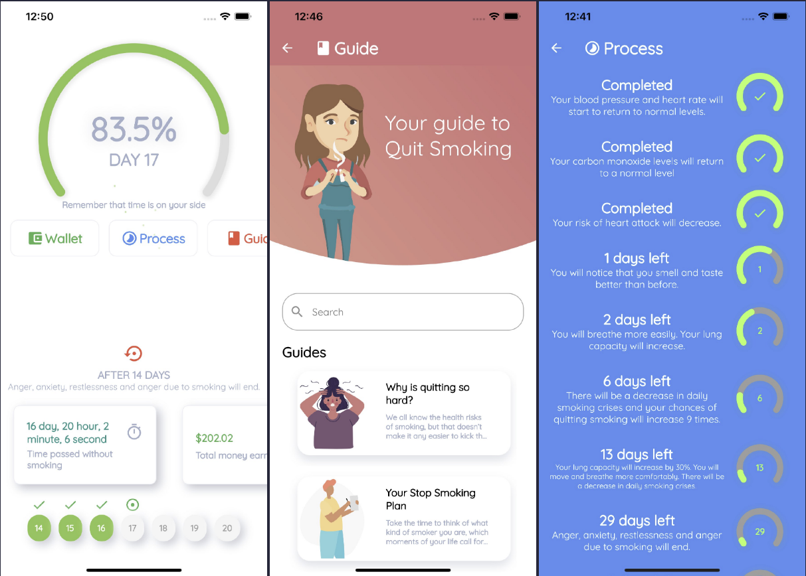
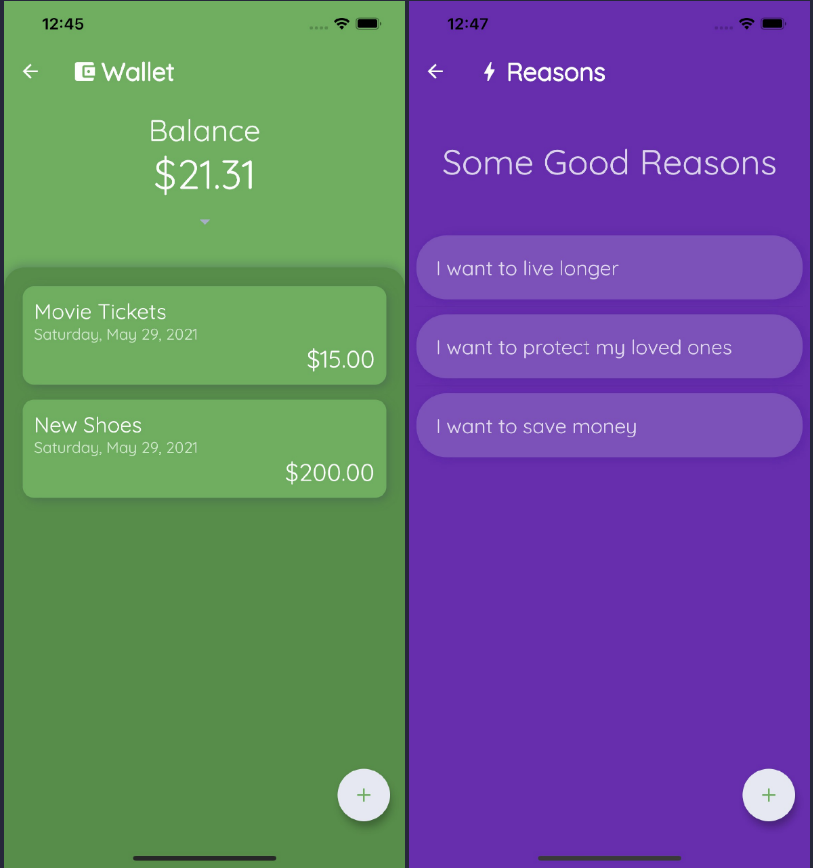

# QuitSmoke

An app I originally made for my father to help him quit smoking. Helps you see how much money you've saved, how many cigarettes you've not smoked, how long you’ve been smoke-free, and how your health is improving. Also includes a guide that I made after a few days of research.

## Some of the futures :star:

- Countdown timer to watch all aspects of your health improve as a result of your great decision to stop this bad habit of smoking.
- Watch your pockets grow and see how much money you saved by not smoking any cigarettes.
- Reward yourself with the money you earned and keep track of it.
- Use our guide to find answers and make the process way easier.
- See how many cigarrates you've not smoked.
- Supports English and Turkish
- List your reasons

## Screens

# Available On

